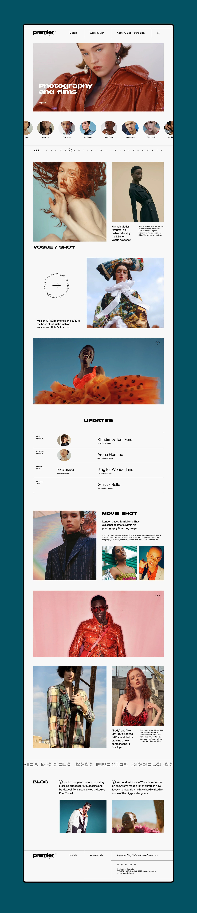

# Premier Models Frontend Practice

This is a simple frontend project built for practice, inspired by a modern modeling agency website layout. The project is implemented using HTML and CSS(with minute amount of animations).

## Features

- Responsive navigation bar
- Hero section with autoplaying video (`demo.mp4`)
- Infinite scrollable marquee with model images and names
- Filter bar and content sections styled according to the reference design

## Reference Design

The UI was built to closely match the following design:

## Video File

The hero section uses a video file named `demo.mp4`. Make sure this file is present in the project root for the video to display correctly.

## Usage

1. Clone or download this repository.
2. Ensure all images and the `demo.mp4` video are present in the correct folders.
3. Open `index.html` in your browser to view the project.

---

This project is for educational and practice purposes only.
